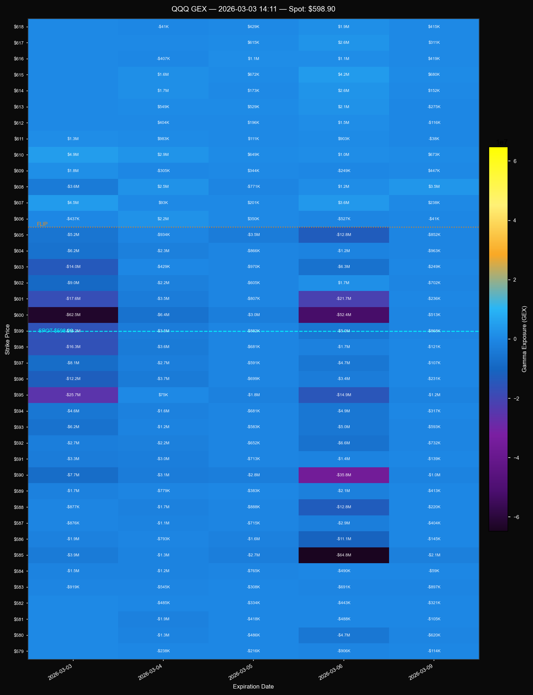

# QQQ GEX Heatmap

A Gamma Exposure (GEX) heatmap tool for options data, with optional Discord bot integration. Fetches live options chains and visualizes dealer gamma positioning across strikes and expiration dates.

---


## What is GEX?

Gamma Exposure measures the estimated hedging pressure that market makers exert on the underlying asset. Positive GEX at a strike tends to suppress price movement (dealers sell rallies, buy dips); negative GEX amplifies it. The heatmap shows this across all nearby strikes and expiries at a glance.

---

## Two Modes

| File | Data source | Use case |
|---|---|---|
| `heatmap.py` | Yahoo Finance (via `yfinance`) | Quick standalone chart, no broker account needed |
| `discord_heatmap.py` | thinkorswim RTD (live) | Automated bot posting to Discord every N minutes |

---

## Setup

### 1. Install dependencies

```bash
pip install -r requirements.txt
```

| Package | Used by |
|---|---|
| `yfinance` | `heatmap.py` — fetches options chain from Yahoo Finance |
| `numpy` / `pandas` / `matplotlib` / `scipy` | Both — data processing and charting |
| `pytz` | Both — market hours check in `America/New_York` |
| `requests` | Both — Discord webhook posting |
| `pywin32` | `discord_heatmap.py` — provides `pythoncom` for COM initialization |
| `comtypes` | `discord_heatmap.py` — required for thinkorswim RTD COM interface |

For the Discord bot mode, you also need the internal RTD client modules (`src/`) that connect to thinkorswim.

### 2. Get free live options data via thinkorswim

`discord_heatmap.py` pulls live Greeks (gamma, open interest) through thinkorswim's **Real-Time Data (RTD)** feed. This is free with a funded TD Ameritrade / Charles Schwab brokerage account.

**Steps:**

1. **Open a Charles Schwab brokerage account** at [schwab.com](https://www.schwab.com). A standard individual account is sufficient — no options approval level is required just to receive data.
2. **Download thinkorswim** from the Schwab trading platform page. Install and log in with your Schwab credentials.
3. **Keep thinkorswim running** while the bot is active. The RTD feed is served locally by the desktop app — the script connects to it via COM (Windows only).

> **Note:** thinkorswim RTD is a Windows-only feature. `discord_heatmap.py` will not run on macOS or Linux.

---

## Configuration

Open the relevant file and update these constants at the top:

```python
TICKER         = 'QQQ'       # Underlying symbol
STRIKE_RANGE   = 20          # ± strikes around spot to display
STRIKE_SPACING = 1.0         # Strike increment
WEBHOOK_URL    = 'https://discordapp.com/api/webhooks/your_webhook_here'
INTERVAL_MIN   = 5           # How often (minutes) the bot posts
```

To get a Discord webhook URL: go to your server → channel settings → Integrations → Webhooks → New Webhook → Copy URL.

---

## Usage

### Standalone chart (yfinance)

```bash
python heatmap.py
```

Fetches the options chain from Yahoo Finance, builds the GEX matrix, and saves `gex_heatmap.png` to the current directory.

### Discord bot (thinkorswim RTD)

```bash
python discord_heatmap.py
```

Runs a loop that:
- Checks whether the US equity market is open (9:30 AM – 4:00 PM ET, weekdays)
- Fetches live gamma and open interest from thinkorswim
- Renders the heatmap and posts it to your Discord channel
- Sleeps until the next interval (default: 5 minutes)
- When the market is closed, sleeps until the next open

---

## Reading the heatmap

- **Yellow / warm tones** → large positive GEX (call-side dealer pressure)
- **Purple / blue tones** → large negative GEX (put-side dealer pressure)
- **Cyan dashed line** → current spot price
- **Orange dotted line** → GEX flip level (where net gamma changes sign)
- **Cell labels** → GEX value at that strike/expiry in dollars (K = thousands, M = millions)

---

## Notes

- `GEX_VMAX_FLOOR` in `heatmap.py` controls the minimum color scale range. The default (`$500M`) is calibrated for QQQ/SPY. Lower it for smaller-cap underlyings or you'll get a flat-looking chart.
- Yahoo Finance data has a delay and IV values can be stale — use this mode for reference only. The thinkorswim mode uses real-time Greeks.
- Market hours check uses `America/New_York` time via `pytz`, so it handles EST/EDT automatically.
